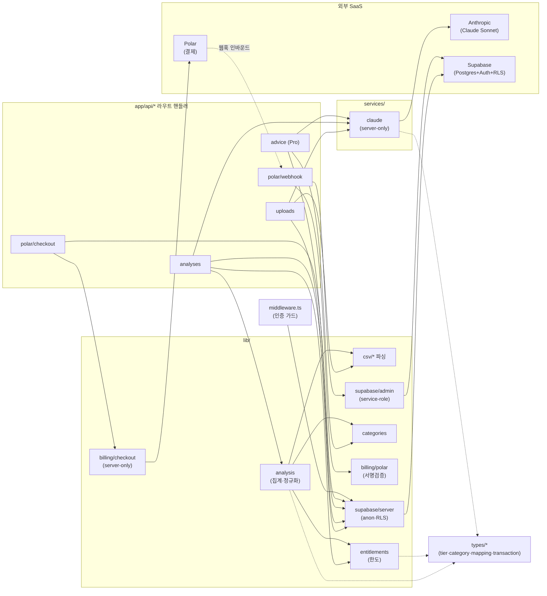
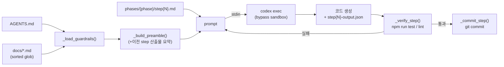

# 아키텍처

## 배포
- **Railway** 상시 컨테이너로 배포. Next.js를 `output: "standalone"`으로 빌드, `next start -p $PORT`로 기동.
- 서버리스가 아니므로 함수 타임아웃 제약 없음 → AI 분석을 동기 요청으로 처리 가능.
- Polar webhook은 Railway 공개 URL로 수신.

## 외부 의존성
| 서비스 | 역할 | 키 노출 |
|--------|------|---------|
| Supabase | Postgres + Auth + RLS + Storage | anon 키만 클라이언트, service-role 키는 서버 전용(웹훅) |
| Anthropic (Claude Sonnet) | CSV 컬럼 매핑 + 거래 분류 | 서버 전용 |
| Polar | 구독 결제 (Merchant of Record) | access token / webhook secret 서버 전용 |

## 모듈 의존성 그래프
> 정적 import 의존성(런타임 데이터 흐름이 아니라 "무엇이 무엇을 부르는가"). 변경 영향 분석용.



## 디렉토리 구조 (루트 기준, `src/` 사용 안 함)
```
app/                  # 페이지 + API 라우트 (App Router)
├── api/              # 라우트 핸들러 (uploads, analyses, polar/*, health)
├── auth/callback/    # Supabase OAuth 콜백
├── dashboard/        # 대시보드 페이지 (force-dynamic)
└── page.tsx          # 랜딩 (정적)
components/           # UI 컴포넌트 (.tsx)
types/                # TypeScript 타입 정의
lib/                  # 순수 유틸 (supabase 클라, csv, entitlements, billing)
services/             # 외부 API 래퍼 (claude)
supabase/migrations/  # SQL 마이그레이션 (0001_init.sql)
```

## 패턴
- Server Components 기본. 인터랙션 필요한 곳(업로드, 매핑 확인)만 Client Component(`"use client"`).
- 외부 API·DB 접근은 서버(라우트 핸들러/서버 컴포넌트)에서만. 클라는 fetch로 자체 API 호출.
- 외부 클라이언트는 함수 내부 lazy 생성(top-level 금지).

## 데이터 흐름
```
사용자 → Client Component(업로드/요청) → app/api/* 라우트 핸들러
      → CSV 파싱 → Claude 컬럼매핑 → 사용자 확인(매핑 수정)
      → Claude 분류(고정 카테고리 enum) → 집계
      → user-scoped Supabase(RLS) 저장 → 응답 → Server Component 리렌더
Polar 웹훅 → app/api/polar/webhook → service-role Supabase → profiles.tier 갱신
```

## 데이터 모델 (개략)
- `profiles` — 유저(Supabase auth 연동), tier, 월 분석 카운트.
- `uploads` — 업로드 단위 메타(파일명, 행 수, 매핑 결과, 생성일).
- `transactions` — 거래 건별(date, merchant, amount, category). RLS로 소유자만 접근.
- `insights` — 업로드별 집계 결과(카테고리별 합계/비율).
- 모든 PII 테이블은 RLS 강제 + at-rest 암호화 + 사용자 "전체 삭제" 지원.

## 상태 관리
- 서버 상태: Server Components가 user-scoped Supabase로 직접 조회(per-user 페이지는 `force-dynamic`).
- 클라이언트 상태: 업로드/분석 트리거 등 인터랙션만 `useState`. 전역 상태 라이브러리 없음.
- 미터링: 분석 성공 시 `profiles`의 월 카운트 +1, Free는 5건 초과 차단. tier는 Polar 웹훅이 갱신.

## 하네스 주입 흐름 (codex `scripts/execute.py`)
> CLAUDE.md는 Claude Code 전용. 하네스는 AGENTS.md + docs/*.md만 프롬프트에 주입한다.


